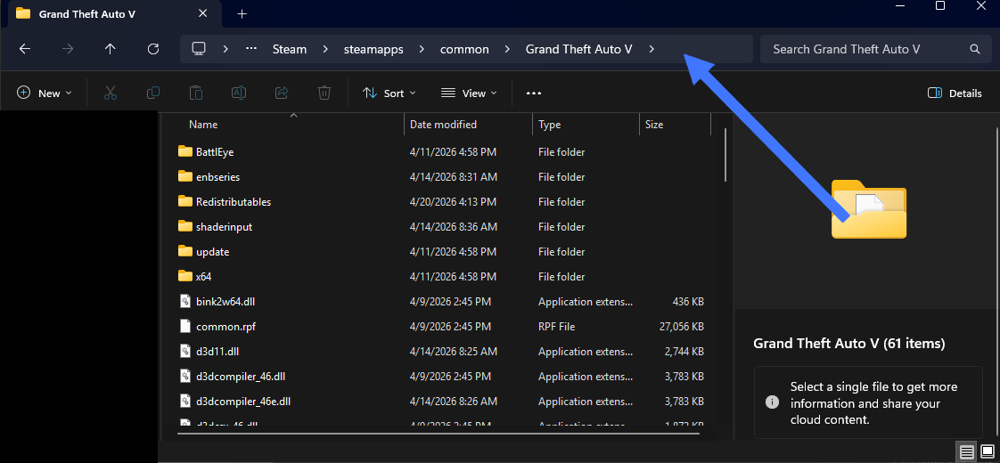
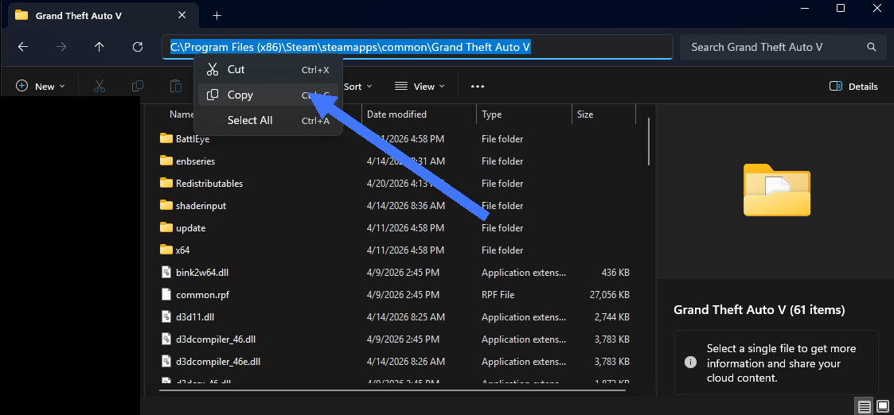

<Tabs>
  <Tab title="Video" icon="video">
    <Frame>
      <iframe
        className="w-full aspect-video rounded-xl"
        src="https://youtube.com/embed/HcemGBwd1g4"
        title="YouTube video player"
        allow="accelerometer; autoplay; clipboard-write; encrypted-media; gyroscope; picture-in-picture"
        allowFullScreen
      ></iframe>
    </Frame>

    If the video does not load, watch it here: https://youtu.be/HcemGBwd1g4

  </Tab>

  <Tab title="Text" icon="text">

# Installing FiveM (Requires Grand Theft Auto V Legacy)

{/* prettier-ignore */}
<Steps>
  <Step title="Locate your Grand Theft Auto V folder">
    Open the launcher you used to install GTA V (Steam, Epic Games, or Rockstar Games Launcher).

    Go to your game library and select **Grand Theft Auto V**.

    Click **Manage** (or settings/options), then select **Browse Local Files**.

    This will open your GTA V installation folder in File Explorer.

  </Step>

  <Step title="Copy the game directory path">
    At the top of File Explorer, click the address bar showing the folder path.

    

    Right-click the highlighted path and select **Copy**.

    

  </Step>

  <Step title="Download FiveM">
    Open your browser and go to **fivem.net**.

    Click **Download Client** and install FiveM.

    When prompted, paste your GTA V folder path.

  </Step>
</Steps>

# Joining Drift Society

{/* prettier-ignore */}
<Steps>
  <Step title="Open FiveM and sign in">
    Launch **FiveM** from your desktop or start menu.

    (Optional) Sign in using your **Cfx.re / Rockstar account**.

    Wait for FiveM to fully load into the main menu.

  </Step>

  <Step title="Find the server">
    Go to the **Play** tab in FiveM.

    Search for **Drift Society**.

    If it does not appear, open the console with <kbd>F8</kbd> and enter:

    ```
    connect play.driftsociety.lol
    ```

    You can also find the latest connect link in the Discord.

  </Step>

  <Step title="Connect to the server">
    Select the **Drift Society** server.

    Click **Connect** and wait for loading to complete.

    Assets may download on first join—this is normal.

  </Step>

  <Step title="Finish loading in">
    Once loaded, follow any in-game or Discord verification steps.

    You are now ready to play on Drift Society.

  </Step>
</Steps>

  </Tab>
</Tabs>
