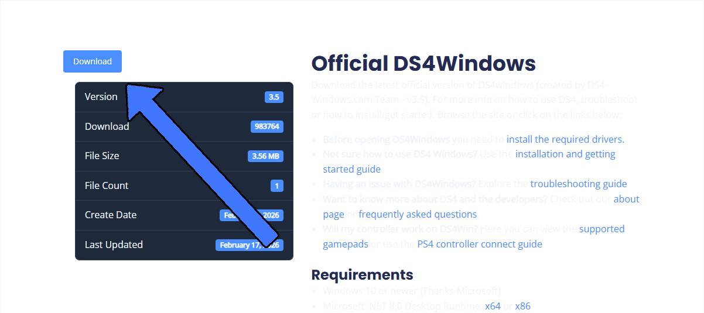
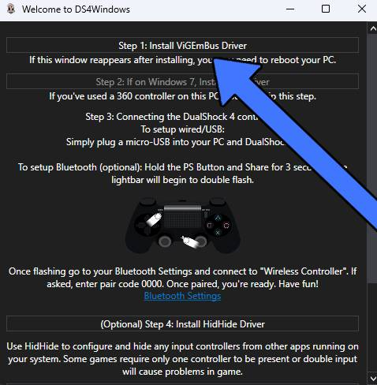
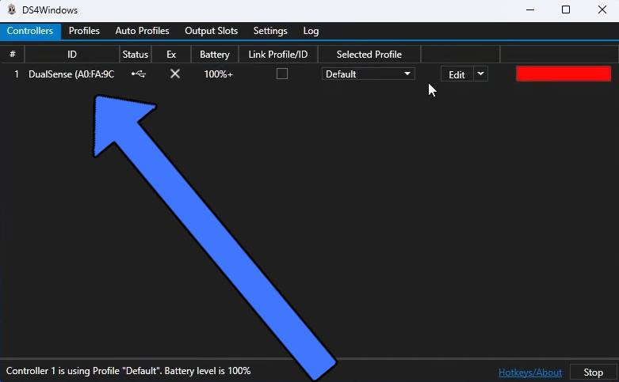

<Tabs>
  <Tab title="Video" icon="video">
    <Frame>
      <iframe
        className="w-full aspect-video rounded-xl"
        src="https://youtube.com/embed/mkAH3X2i1PM"
        title="YouTube video player"
        allow="accelerometer; autoplay; clipboard-write; encrypted-media; gyroscope; picture-in-picture"
        allowFullScreen
      ></iframe>
    </Frame>

    If the video does not load, watch it here: https://youtu.be/mkAH3X2i1PM

  </Tab>

  <Tab title="Text" icon="text">

# Using a PlayStation Controller on Drift Society

<Steps>

  <Step title="Download DS4Windows">
    Download the latest version of [DS4Windows](https://ds4-windows.com/download/official/) and extract the ZIP.

    

  </Step>

  <Step title="Install drivers">
    Open DS4Windows and complete the setup.

    Click **Step 1: Install ViGEmBus Driver** and finish installation.

    

  </Step>

<Step title="Connect your controller">
  Plug in your PlayStation controller with USB or connect via Bluetooth.

    - if its your first time using your controller for DS4 Windows, u need to use wired not Bluetooth

  </Step>

  <Step title="Verify connection">
    Make sure your controller appears as connected in DS4Windows.

    

  </Step>

<Step title="Launch FiveM">Open FiveM and wait for it to load.</Step>

  <Step title="Join Drift Society">
    Go to the **Play** tab, search **Drift Society**, and connect.

    Or press <kbd>F8</kbd> and run:
    ```
    connect play.driftsociety.lol
    ```

  </Step>
</Steps>
  </Tab>
</Tabs>
